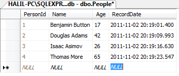
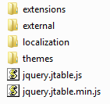
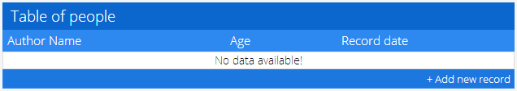
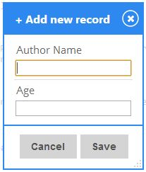
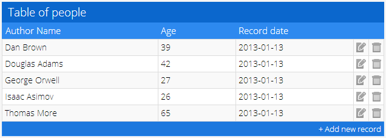
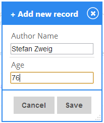
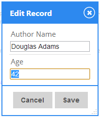
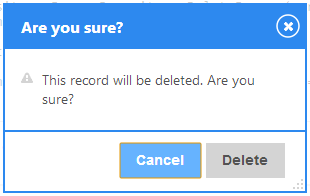
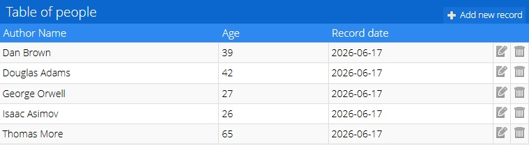

# Getting Started

## Introduction

Here, we will examine a simple table implementation with **jTable**. Assume that you have a database table as shown below. For more complex tables, see the samples in the [demo list](https://www.jtable.org/Demo).

<figure><figcaption></figcaption></figure>

Surely, you don't have to work with SQL Server, or even with a DBMS. jTable does not care about any server-side technology.

## Dependencies

**jTable** depends on **jQuery** and **jQueryUI**. So, if you have not already done so, you must first download the latest versions of these libraries from [jquery.com](http://www.jquery.com/).

## Downloading jTable

You can download jTable from the [Downloads](https://www.jtable.org/Home/Downloads) section. You can also get it from [NuGet](https://nuget.org/packages/jTable/) if you are using Visual Studio.

After downloading, you will have a folder structure like this:

<figure><figcaption></figcaption></figure>

## Creating Header

Add these lines to the **HEAD** section of your HTML document:

```html
<!-- Include one of jTable styles. -->
<link href="/jtable/themes/metro/blue/jtable.min.css" rel="stylesheet" type="text/css" />
 
<!-- Include jTable script file. -->
<script src="/jtable/jquery.jtable.min.js" type="text/javascript"></script>
```

You can select any theme and color scheme in the themes folder.

NOTE: You must also add the required **jQuery** and **jQueryUI** JavaScript and CSS files before importing jTable files.

## Creating a container

jTable only needs a container element for your table.

```html
<div id="PersonTableContainer"></div>
```

Container element can be a simple **div** element, as shown above.

## Creating a jTable instance

Add this JavaScript code to your page:

```html
<script type="text/javascript">
    $(document).ready(function () {
        $('#PersonTableContainer').jtable({
            title: 'Table of people',
            actions: {
                listAction: '/GettingStarted/PersonList',
                createAction: '/GettingStarted/CreatePerson',
                updateAction: '/GettingStarted/UpdatePerson',
                deleteAction: '/GettingStarted/DeletePerson'
            },
            fields: {
                PersonId: {
                    key: true,
                    list: false
                },
                Name: {
                    title: 'Author Name',
                    width: '40%'
                },
                Age: {
                    title: 'Age',
                    width: '20%'
                },
                RecordDate: {
                    title: 'Record date',
                    width: '30%',
                    type: 'date',
                    create: false,
                    edit: false
                }
            }
        });
    });
</script>
```

All HTML and JavaScript codes ready! We set **title** of the table, **action URL**s to perform AJAX operations on server and **structure** of our **Person record fields**. If you run the page now, you will see the table without data:

<figure><figcaption></figcaption></figure>

If you click the '+ Add new record' link, a dialog is automatically created:

<figure><figcaption></figcaption></figure>

We must create **server-side** code to be able to run the page.

## Creating the list action

[**listAction**](https://www.jtable.org/ApiReference#act-listAction) option of jTable is used to get data to create table of records. It's a regular URL as '/GettingStarted/PersonList'. If you are working with PHP, It maybe '/GettingStarted/PersonList.php' ...etc. jTable performs an ajax POST request to this URL to get records when you call the [**load**](https://www.jtable.org/ApiReference#met-load) method.

**load** method can be called after table initialized.

```html
$('#PersonTableContainer').jtable('load');
```

All server actions those are used by jTable must return a **JSON object**. This is a sample return value for this example:

```html
{
 "Result":"OK",
 "Records":[
  {"PersonId":1,"Name":"Benjamin Button","Age":17,"RecordDate":"\/Date(1320259705710)\/"},
  {"PersonId":2,"Name":"Douglas Adams","Age":42,"RecordDate":"\/Date(1320259705710)\/"},
  {"PersonId":3,"Name":"Isaac Asimov","Age":26,"RecordDate":"\/Date(1320259705710)\/"},
  {"PersonId":4,"Name":"Thomas More","Age":65,"RecordDate":"\/Date(1320259705710)\/"}
 ]
}
```

**Don't worry about creating a JSON object. All common server side technologies have ability to create these objects easily (see samples below)**.

**Result** property can be "**OK**" or "**ERROR**". If it is "OK", **Records** property must be an array of records. If it is "ERROR", a **Message** property can explain reason of the error to show to the user. You can take a look at the [API reference document](https://www.jtable.org/ApiReference#act-listAction) to see supported date formats.

Here, there are sample server-side codes for **listAction** in some common server-side technologies:




```csharp
[HttpPost]
public JsonResult PersonList()
{
    try
    {
        List<Person> persons = _repository.PersonRepository.GetAllPeople();
        return Json(new { Result = "OK", Records = persons });
    }
    catch (Exception ex)
    {
        return Json(new { Result = "ERROR", Message = ex.Message });
    }
}
```





```csharp
[WebMethod(EnableSession = true)]
public static object PersonList()
{
    try
    {
        List<Person> persons = _repository.PersonRepository.GetAllPeople();
        return new { Result = "OK", Records = persons };
    }
    catch (Exception ex)
    {
        return new { Result = "ERROR", Message = ex.Message };
    }
}
```





```php
//Get records from database
$result = mysql_query("SELECT * FROM people;");
 
//Add all records to an array
$rows = array();
while($row = mysql_fetch_array($result))
{
    $rows[] = $row;
}
 
//Return result to jTable
$jTableResult = array();
$jTableResult['Result'] = "OK";
$jTableResult['Records'] = $rows;
print json_encode($jTableResult);
```




Download all samples from [download page](https://www.jtable.org/Home/Downloads).

Now we can run the page and see the result:

<figure><figcaption></figcaption></figure>

## Creating a new record

When we click the '**+ Add new record**' link below the table, a **create record form** is **automatically** generated by jTable:

<figure><figcaption></figcaption></figure>

When we try to add a person, we get an error since we have not implemented **createAction** yet. The **createAction** option of jTable is used to submit a create record form with **POST** to the server. When you press the Save button, POST data is sent to the server as shown below:

```html
Name=Dan+Brown&Age=55
```

On the server side, you can save a new person to the database. **createAction** **must return** the newly created record as a JSON object. A **sample** return value for **createAction** can be:

```html
{
 "Result":"OK",
 "Record":{"PersonId":5,"Name":"Dan Brown","Age":55,"RecordDate":"\/Date(1320262185197)\/"}
}
```

Same as all jTable actions, returning object must contain a **Result** property that's value can be "**OK**" or "**ERROR**". If it's "OK", **Record** property is the created record.

Here, there are sample server-side codes for **createAction** in some common server-side technologies:




```csharp
[HttpPost]
public JsonResult CreatePerson(Person person)
{
    try
    {
        Person addedPerson = _repository.PersonRepository.AddPerson(person);
        return Json(new { Result = "OK", Record = addedPerson });
    }
    catch (Exception ex)
    {
        return Json(new { Result = "ERROR", Message = ex.Message });
    }
}
```





```csharp
[WebMethod(EnableSession = true)]
public static object CreatePerson(Person record)
{
    try
    {
        Person addedPerson = _repository.PersonRepository.AddPerson(record);
        return new { Result = "OK", Record = addedPerson };
    }
    catch (Exception ex)
    {
        return new { Result = "ERROR", Message = ex.Message };
    }
}
```





```php
//Insert record into database
$result = mysql_query("INSERT INTO people(Name, Age, RecordDate) VALUES('" . $_POST["Name"] . "', " . $_POST["Age"] . ",now());");
 
//Get last inserted record (to return to jTable)
$result = mysql_query("SELECT * FROM people WHERE PersonId = LAST_INSERT_ID();");
$row = mysql_fetch_array($result);
 
//Return result to jTable
$jTableResult = array();
$jTableResult['Result'] = "OK";
$jTableResult['Record'] = $row;
print json_encode($jTableResult);
```




Download all samples from [download page](https://www.jtable.org/Home/Downloads).

When server successfully saves the new record, same record is automatically added to the jTable with an animation.

## Editing/Updating a record

When we click the **edit icon** for a record, an **edit record form** is **automatically** generated by jTable:

<figure><figcaption></figcaption></figure>

When we change the age of Dougles Adams and **save** the form, a **POST** operation is made to the **updateAction** URL with the following values:

```html
PersonId=2&Name=Douglas+Adams&Age=43
```

In the server side, you can **update fields** in the database table for PersonId=2. updateAction must return a JSON object like that:

```html
{"Result":"OK"}
```

If **Result** is "**ERROR**", a **Message** property can explain the reason for the error. If **Result** is "**OK**", jTable updates the cells in the table on the page with an animation.

Here are sample server-side code examples for **updateAction** in some common server-side technologies:




```csharp
[HttpPost]
public JsonResult UpdatePerson(Person person)
{
    try
    {
        _repository.PersonRepository.UpdatePerson(person);
        return Json(new { Result = "OK" });
    }
    catch (Exception ex)
    {
        return Json(new { Result = "ERROR", Message = ex.Message });
    }
}
```





```csharp
[WebMethod(EnableSession = true)]
public static object UpdatePerson(Person record)
{
    try
    {
        _repository.PersonRepository.UpdatePerson(record);
        return new { Result = "OK" };
    }
    catch (Exception ex)
    {
        return new { Result = "ERROR", Message = ex.Message };
    }
}
```





```php
//Update record in database
$result = mysql_query("UPDATE people SET Name = '" . $_POST["Name"] . "', Age = " . $_POST["Age"] . " WHERE PersonId = " . $_POST["PersonId"] . ";");
 
//Return result to jTable
$jTableResult = array();
$jTableResult['Result'] = "OK";
print json_encode($jTableResult);
```




Download all samples from [download page](https://www.jtable.org/Home/Downloads).

## Deleting a record

When we click the **delete icon** for a record, a confirmation dialog is shown to the user by jTable. Confirmation is optional, but it is enabled by default:

<figure><figcaption></figcaption></figure>

When we click the delete button, a POST operation is made to the **deleteAction** URL with the following values:

```html
<!-- jQuery UI theme -->
<link href="https://www.jtable.org/Content/themes/metroblue/jquery-ui.css" rel="stylesheet" />

PersonId=3
```

You can delete the record 3 in the server. deleteAction also returns a JSON object like that:

```html
{"Result":"OK"}
```

If **Result** is "**ERROR**", a **Message** property can explain the reason for the error. If **Result** is "**OK**", jTable deletes the related row from the table on the page with an animation.

Here are sample server-side code examples for **deleteAction** in some common server-side technologies:




```csharp
[HttpPost]
public JsonResult DeletePerson(int personId)
{
    try
    {
        _repository.PersonRepository.DeletePerson(personId);
        return Json(new { Result = "OK" });
    }
    catch (Exception ex)
    {
        return Json(new { Result = "ERROR", Message = ex.Message });
    }
}
```





```csharp
[WebMethod(EnableSession = true)]
public static object DeletePerson(int PersonId)
{
    try
    {
        _repository.PersonRepository.DeletePerson(PersonId);
        return new { Result = "OK" };
    }
    catch (Exception ex)
    {
        return new { Result = "ERROR", Message = ex.Message };
    }
}
```





```php
//Delete from database
$result = mysql_query("DELETE FROM people WHERE PersonId = " . $_POST["PersonId"] . ";");
 
//Return result to jTable
$jTableResult = array();
$jTableResult['Result'] = "OK";
print json_encode($jTableResult);
```




Download all samples from [download page](https://www.jtable.org/Home/Downloads).

## The result

Here, the result jTable instance. Try it yourself:

<figure><figcaption></figcaption></figure>
